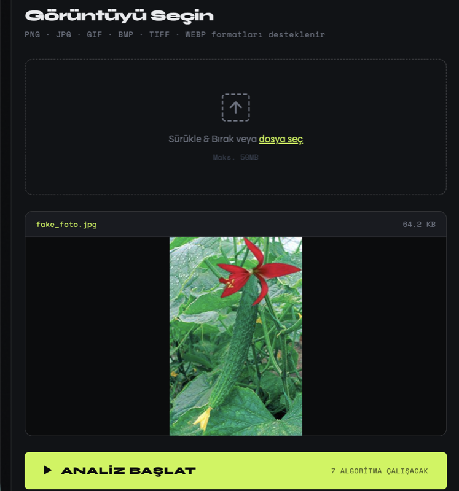
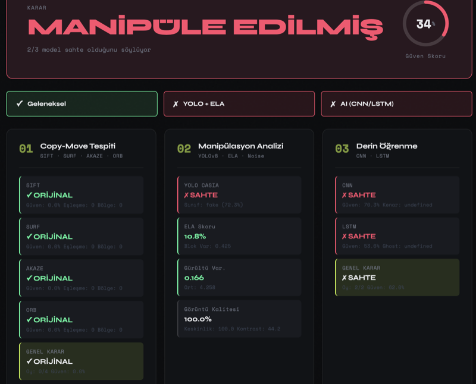
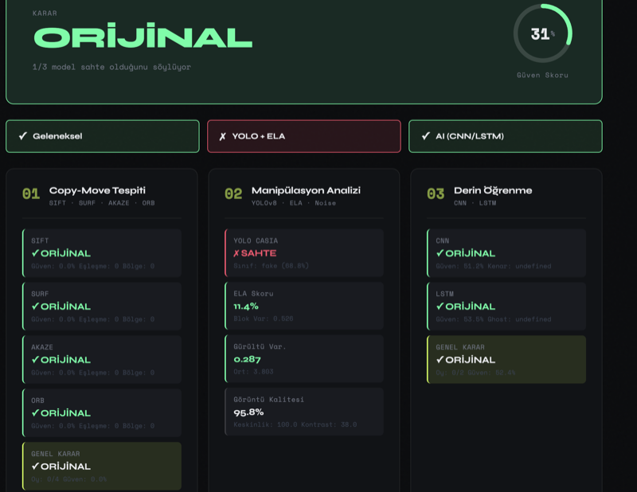

# 🔍 ForensicAI — Image Forgery Detection

A multi-layered image manipulation detection system developed as an R&D project. Analyzes uploaded images using **7 different algorithms** and makes a final decision via majority voting.

---

## 📸 Screenshots

### Upload Screen



### Fake Image Result



### Original Image Result



---

## 📋 User Story Coverage

| User Story | Description                                    | Status  |
| ---------- | ---------------------------------------------- | ------- |
| US-1       | GIF, JPEG, PNG, BMP, TIFF, WEBP format support | ✅ Done |
| US-2       | SIFT, SURF, AKAZE, ORB copy-move detection     | ✅ Done |
| US-2       | YOLOv8 CASIA model for manipulation detection  | ✅ Done |
| US-2       | ELA (Error Level Analysis)                     | ✅ Done |
| US-3       | CNN-based forgery detection                    | ✅ Done |
| US-3       | LSTM-based forgery detection                   | ✅ Done |

---

## 🏗️ Project Structure

```
image-forgery-detection/
├── app.py                   # Flask backend
├── train_cnn_lstm.py        # CNN & LSTM training script
├── requirements.txt
├── docs/                    # Screenshots
│   ├── upload.png
│   ├── fake_result.png
│   └── real_result.png
├── models/
│   ├── traditional.py       # SIFT, SURF, AKAZE, ORB
│   ├── yolo_model.py        # YOLOv8 + ELA + Noise analysis
│   ├── ai_models.py         # CNN + LSTM
│   ├── casia_model.pt       # YOLOv8 model trained on CASIA2
│   ├── cnn_model.h5         # CNN model trained on CASIA2
│   └── lstm_model.h5        # LSTM model trained on CASIA2
├── static/
│   ├── css/style.css
│   ├── js/script.js
│   └── uploads/
└── templates/
    └── index.html
```

---

## 🤖 Algorithms

### 1. Traditional Methods — Copy-Move Detection

| Algorithm | Description                                                              |
| --------- | ------------------------------------------------------------------------ |
| **SIFT**  | Scale-Invariant Feature Transform — robust to scale and rotation changes |
| **SURF**  | Speeded-Up Robust Features — faster variant of SIFT (patented)           |
| **AKAZE** | Accelerated KAZE — binary descriptor, fast and patent-free               |
| **ORB**   | Oriented FAST and Rotated BRIEF — optimized for real-time use            |

All traditional methods use kNN matching and clustering to detect copy-moved regions within the same image.

### 2. YOLOv8 + ELA + Noise Analysis

| Component            | Description                                                             |
| -------------------- | ----------------------------------------------------------------------- |
| **YOLOv8 CASIA**     | Classification model trained on CASIA2 dataset                          |
| **ELA**              | Error Level Analysis — detects JPEG compression inconsistencies         |
| **Noise Analysis**   | Regional noise variation — tampered areas show different noise profiles |
| **Quality Analysis** | Sharpness, contrast, and brightness metrics                             |

### 3. Deep Learning — CNN + LSTM

| Model    | Architecture                                  | Training Data              |
| -------- | --------------------------------------------- | -------------------------- |
| **CNN**  | 4× Conv2D + BatchNorm + GlobalAvgPool + Dense | CASIA2 (Au + Tp)           |
| **LSTM** | 2× LSTM + Dense                               | CASIA2 (row-wise sequence) |

> **Note:** CNN and LSTM models were trained on the CASIA2 dataset with limited epochs. Test accuracy is 62% (CNN) and 55% (LSTM). Higher accuracy can be achieved with more data and augmentation.

---

## ⚙️ Decision Mechanism

The system uses **majority voting** across three detection blocks:

```
Block 1: Traditional (SIFT / SURF / AKAZE / ORB)  →  Vote
Block 2: YOLO + ELA + Noise                        →  Vote
Block 3: CNN + LSTM                                →  Vote

2/3 or 3/3 votes "Fake"  →  MANIPULATED
0/3 or 1/3 votes "Fake"  →  ORIGINAL
```

---

## 🚀 Installation

```bash
# Create virtual environment
python3 -m venv venv
source venv/bin/activate

# Install dependencies
pip install -r requirements.txt

# Start the application
python3 app.py
```

Open `http://localhost:5001` in your browser.

---

## 📦 Requirements

```
flask
flask-cors
opencv-python
ultralytics
numpy
tensorflow
scikit-learn
Pillow
```

---

## 🗂️ Dataset

**CASIA2.0** — Image Tampering Detection Evaluation Database

- `Au/` — Authentic (original) images
- `Tp/` — Tampered (manipulated) images
- Total: ~12,000 images

---

## 📊 Model Performance

| Model        | Test Accuracy | Training Data              |
| ------------ | ------------- | -------------------------- |
| YOLOv8 CASIA | —             | CASIA2 (YOLO format)       |
| CNN          | 62.25%        | CASIA2 (1000 Au + 1000 Tp) |
| LSTM         | 55.75%        | CASIA2 (1000 Au + 1000 Tp) |

> CNN and LSTM were trained with limited data and epochs. Retraining with the full dataset and data augmentation is planned to improve accuracy.

---

## 👩‍💻 Developer

Image Forgery Detection — R&D Project
